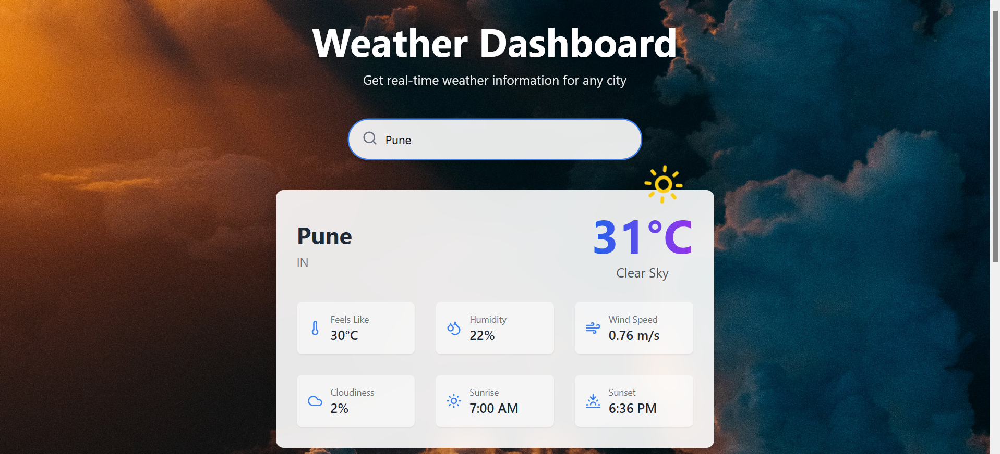

<!-- filepath: /D:/Pavan_Khamitkar/Frontend/Weather_app/README.md -->
# Weather Dashboard App 🌤️

A modern, responsive weather application built with React, TypeScript, and Vite that provides real-time weather information and forecasts.



## ✨ Features

- Real-time weather data fetching using OpenWeatherMap API
- 5-day weather forecast with interactive charts
- Responsive design for all devices
- Dynamic weather animations and transitions
- Beautiful UI with glassmorphism effects
- Error handling and loading states
- Dynamic backgrounds based on weather conditions

## 🛠️ Tech Stack

- **Frontend Framework:** React 18 with TypeScript
- **Build Tool:** Vite
- **Styling:** TailwindCSS
- **API:** OpenWeatherMap API
- **State Management:** React Hooks
- **Charts:** Recharts
- **Animations:** Framer Motion
- **Icons:** Lucide React
- **Date Handling:** date-fns
- **Code Quality:** ESLint, TypeScript

## 🚀 Quick Start

1. Clone the repository
```bash
git clone https://github.com/PavanKhamitkar/Real-Time_Weather_Website.git
cd weather-dashboard
```

2. Create `.env` file in the root directory
```bash
VITE_WEATHER_API_KEY=your_openweathermap_api_key
```

3. Install dependencies
```bash
npm install
```

4. Start the development server
```bash
npm run dev
```

## 📁 Project Structure

```
src/
├── components/
│   ├── WeatherCard.tsx       # Main weather information display
│   ├── HistoricalWeather.tsx # 5-day forecast chart
│   └── WeatherAnimation.tsx  # Weather-specific animations
├── App.tsx                   # Main application component
├── main.tsx                  # Application entry point
└── index.css                # Global styles
```

## 🎨 Key Components

### WeatherCard
- Displays current weather data
- Shows temperature, humidity, wind speed
- Sunrise and sunset times
- Responsive grid layout for weather metrics

### HistoricalWeather
- Interactive line chart for temperature trends
- 5-day forecast visualization
- Custom tooltips with detailed information

### WeatherAnimation
- Dynamic weather icons based on conditions
- Smooth animations using Framer Motion
- Support for various weather states

## 🔧 Configuration

The project uses several configuration files:
- `vite.config.ts` - Vite configuration
- `tailwind.config.js` - TailwindCSS customization
- `tsconfig.json` - TypeScript configuration

## 🌐 API Integration

The app uses OpenWeatherMap API for:
- Current weather data
- 5-day weather forecasts
- Weather conditions and codes
- Temperature, humidity, wind data

## 🎯 Future Improvements

- [ ] Add geolocation support
- [ ] Implement weather alerts
- [ ] Add unit conversion (Celsius/Fahrenheit)
- [ ] Add more weather metrics
- [ ] Implement PWA support
- [ ] Add dark/light theme toggle

## 📄 License

This project is licensed under the MIT License - see the LICENSE file for details.

## 🤝 Contributing

Contributions, issues, and feature requests are welcome! Feel free to check issues page.

---
